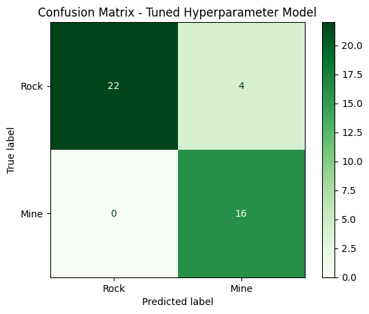
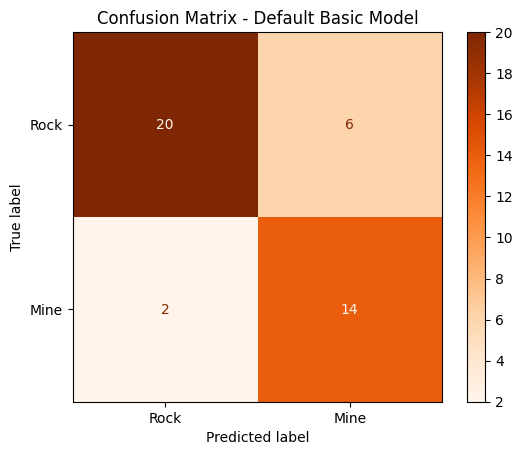

# 🤖 Sonar Signal Classification using Neural Networks

## 📌 Problem Statement

The objective of this project is to classify sonar signals as either **rock** or **mine** using a neural network model.

---

## 📊 Dataset

* Dataset used: **Sonar Dataset**
* Contains:

  * 60 numerical features (signal frequencies)
  * Target label:

    * `R` → Rock
    * `M` → Mine

This is a binary classification problem.

---

## ⚙️ Approach

### 1. Data Preprocessing

* Converted categorical labels (`R`, `M`) into numerical values
* Checked for missing values
* Scaled features using **StandardScaler**

---

### 2. Train-Test Split

* Split dataset into training and testing sets
* Maintained proper distribution of classes

---

### 3. Model Building

* Built a **Neural Network using Keras (TensorFlow)**
* Used:

  * Input layer (60 features)
  * Hidden layers with activation functions (ReLU)
  * Output layer with sigmoid activation (binary classification)

---

### 4. Model Training

* Used:

  * Loss function: **Binary Crossentropy**
  * Optimizer: **Adam**
* Trained model for multiple epochs

---

### 5. Model Evaluation

## 📊 Confusion Matrix

)
* Evaluated performance using:

  * Accuracy
  * Confusion Matrix

---

## 📈 Results

* Model achieved good classification accuracy on test data
* Successfully distinguished between rock and mine signals

---

## 🔍 Key Insights

* Neural networks can capture complex patterns in high-dimensional data
* Feature scaling significantly improves model performance
* Proper architecture and activation functions are critical

---

## 🚀 Future Improvements

* Tune hyperparameters (layers, neurons, learning rate)
* Use dropout to prevent overfitting
* Compare with other models (SVM, Random Forest)
* Perform cross-validation

---

## 🛠️ Technologies Used

* Python
* Pandas, NumPy
* Scikit-learn
* TensorFlow / Keras

---

## 📌 Conclusion

This project demonstrates how neural networks can be applied to classification problems involving complex numerical data. It highlights the importance of preprocessing, model design, and evaluation in building effective deep learning models.
